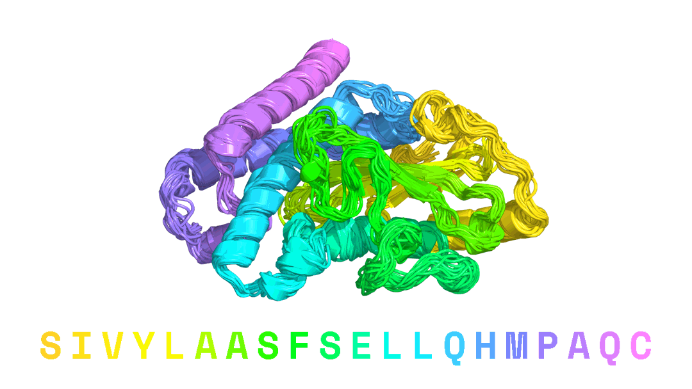

# Caliby
Official repository for Caliby, a Potts model-based protein sequence design method that can condition on structural ensembles. For more details, read our preprint: [Ensemble-conditioned protein sequence design with Caliby](https://www.biorxiv.org/content/10.1101/2025.09.30.679633v4)

This repository contains code for sequence design, ensemble generation with Protpardelle-1c, ensemble-conditioned sequence design, and sequence scoring.

Both this repository and Caliby are still under active development, so please reach out if you have any questions or feature requests! To re-train Caliby, training and dataset preprocessing code should mostly be provided within this repository, but we plan to update in the future with more detailed instructions.



# Table of Contents
- [Installation](#installation)
  - [Option 1: Basic `uv` installation (preferred)](#option-1-basic-uv-installation-preferred)
  - [Option 2: Apptainer installation](#option-2-apptainer-installation)
- [Download model weights](#download-model-weights)
- [Usage](#usage)
  - [Sequence design](#sequence-design)
  - [Backbone ensemble generation with Protpardelle-1c](#backbone-ensemble-generation-with-protpardelle-1c)
  - [Ensemble-conditioned sequence design](#ensemble-conditioned-sequence-design)
    - [Sequence design with synthetic Protpardelle-1c ensembles](#sequence-design-with-synthetic-protpardelle-1c-ensembles)
    - [Providing your own ensembles](#providing-your-own-ensembles)
  - [Scoring](#scoring)
  - [Additional sequence design options](#additional-sequence-design-options)
    - [Globally omit certain amino acids](#globally-omit-certain-amino-acids)
    - [Position-wise constraints](#position-wise-constraints)
  - [Sidechain packing](#sidechain-packing)
- [License](#license)
- [Citation](#citation)

# Installation
Follow the below instructions for setting up the environment. After you've installed the environment, edit `env_setup.sh` to point to your environment directory, and run `source env_setup.sh` before running any scripts (see example scripts in `examples/scripts`).

## Option 1: Basic `uv` installation (preferred)
To run the scripts in this repository, we recommend using `uv` for package management. If you don't already have `uv` installed, follow the official installation instructions [here](https://docs.astral.sh/uv/getting-started/installation/#installation-methods).

Then, run the following commands to install the dependencies:
```
# Clone the repository.
git clone https://github.com/ProteinDesignLab/caliby.git
cd caliby

# Create and activate the environment.
ENV_DIR=envs  # or any other directory of your choice
mkdir -p ${ENV_DIR}
uv venv ${ENV_DIR}/caliby -p python3.12
source $ENV_DIR/caliby/bin/activate

# Install the dependencies.
uv pip sync uv_indexes.txt uv.lock -c pins.txt --index-strategy=unsafe-best-match
uv pip install -e .
```

## Option 2: Apptainer installation
If the above workflow does not work for you, and you instead need to run Caliby within an Apptainer container, first set `ENV_DIR` and `IMG` in `build_apptainer.sh` to the directory you want to use for the environment and the image path, respectively. Then, you can run `./build_apptainer.sh` to download the container and install the environment within the container

After the setting up the container and environment, you can run Caliby scripts within the container by wrapping the script in `apptainer exec --nv`. For example, to run `examples/scripts/seq_des_multi.sh` within the container, you can run:
```
IMG=${PWD}/containers/pytorch_24.12.sif
apptainer exec --nv \
  ${IMG} \
  bash -lc '
  source env_setup.sh
  ./examples/scripts/seq_des_multi.sh
'
```

## Download model weights
To download the model weights, run `./download_model_params.sh`, which will download the model weights from [Zenodo](https://zenodo.org/records/17263678) and extract them into the `model_params/` directory. These weights include both the Caliby model and the Protpardelle-1c model.

We offer two model checkpoints for Caliby:
- `caliby.ckpt`: the default Caliby model trained on all chains in the PDB with 0.3Å Gaussian noise.
- `soluble_caliby.ckpt`: SolubleCaliby, an analog to SolubleMPNN ([Goverde et al., 2024](https://www.nature.com/articles/s41586-024-07601-y)) trained by excluding all annotated transmembrane proteins.

# Usage

## Sequence design
To design sequences for a set of PDBs, see `examples/scripts/seq_des_multi.sh`. This script takes in a `input_cfg.pdb_dir` and will design sequences for all PDBs in the directory.

To design sequences for a subset of PDBs within the directory, see `examples/scripts/seq_des_multi_subset.sh`. This script takes in a `input_cfg.pdb_dir` and a `input_cfg.pdb_name_list` (a list of filenames with extensions to use from the directory) and will design sequences for the PDBs specified in the list.

## Backbone ensemble generation with Protpardelle-1c
We found that instead of designing on a static structure, running sequence design on *synthetic ensembles* generated by Protpardelle-1c partial dfifusion produces sequences that are both more diverse and more likely to be predicted by AlphaFold2 to fold into the target structure. To generate ensembles with Protpardelle-1c in a format compatible with Caliby, we have provided a script in `examples/scripts/generate_ensembles.sh`.

For each PDB provided in `input_cfg.pdb_dir`, this script will generate `num_samples_per_pdb` samples per PDB with Protpardelle-1c partial diffusion. For ensemble-conditioned sequence design, we recommend generating at least 32 samples per PDB, but 16 or 8 samples can also give good results.

## Ensemble-conditioned sequence design
### Sequence design with synthetic Protpardelle-1c ensembles
After you've generated ensembles with Protpardelle-1c, you can run ensemble-conditioned sequence design with `examples/scripts/seq_des_multi_ensemble.sh`, which will run ensemble-conditioned sequence design on all ensembles in `input_cfg.conformer_dir`. You can use `examples/scripts/seq_des_multi_ensemble_subset.sh` to run on a subset of the ensembles by providing a `input_cfg.pdb_name_list` file.

### Providing your own ensembles
The Protpardelle-1c ensemble generation script described above will produce a directory structure that is compatible with the `seq_des_multi_ensemble.sh` script, but if you want to provide your own ensembles, you should format your ensembles as described below.

Given a top-level directory passed into the `seq_des_multi_ensemble.sh` script (e.g., `cc95-epoch3490-sampling_partial_diffusion-ss1.0-schurn0-ccstart0.0-dx0.0-dy0.0-dz0.0-rewind150`), each subdirectory is named `<PDB_KEY>`, representing one ensemble. Inside each ensemble subdirectory, the following files are expected:
  - **Primary conformer**: The original structure file (identified by `<PDB_KEY>.pdb` or `<PDB_KEY>.cif`) serving as the default representative conformer and is always included in the ensemble by default.
  - **Additional conformers**: All other `.pdb` or `.cif` files in the directory are treated as conformer files, which will be ordered by their natural alphabetical order with python's `natsort` library.

The sequence design script takes in a `max_num_conformers` argument, which defaults to 32 and will be used to determine the maximum number of conformers to include in the ensemble. By default, the primary conformer will always be included in the ensemble. Then, we choose additional conformers, in order, until we have `max_num_conformers` conformers in the ensemble or we run out of conformers. We recommend using 32 conformers, but 8 or 16 conformers can also give good results.

## Scoring
All sequence design scripts automatically save the global energy of the sequences they design in the resulting `seq_des_outputs.csv` file. Additionally, Caliby can score sequences on a set of input PDBs via `examples/scripts/score.sh`. This will produce a `score_outputs.csv` file that contains a column `U`, which is the energy computed from the Potts model.

You can also score a sequence against an ensemble of backbones via `examples/scripts/score_ensemble.sh`, where the ensembles should be provided in the same format as described in the previous section. When scoring a sequence against an ensemble, the sequence corresponding to the primary conformer will be scored, and the sequences of the additional conformers will be ignored.

## Additional sequence design options

All sequence design options can be found in `caliby/configs/seq_des/atom_mpnn_inference.yaml`. These options can be overridden from `seq_des_multi.sh` and `seq_des_multi_ensemble.sh` via the `sampling_cfg_overrides` argument using hydra override syntax, e.g. `++sampling_cfg_overrides.omit_aas=["C"]` or `++sampling_cfg_overrides.potts_sampling_cfg.potts_sweeps=5000`.

### Globally omit certain amino acids
Caliby can omit certain amino acids from design via the `omit_aas` argument. This should be specified as a list of amino acids to omit, e.g. `["C", "G"]`.

### Position-wise constraints
Caliby also supports applying various constraints on certain residues, specified via the `pos_constraint_csv` argument. This CSV should contain a `pdb_key` column denoting which PDB the constraints should apply to, and a subset of columns in `["fixed_pos_seq", "fixed_pos_scn", "fixed_pos_override_seq", "pos_restrict_aatype"]`.

| Column name | Format example | Description |
|-------------|----------------|-------------|
| `pdb_key` | `8xhz` | The PDB file stem (filename without extension) to apply the constraints to. For ensemble-conditioned sequence design, `pdb_key` should be the name of the ensemble subdirectory. |
| `fixed_pos_seq` | `A1-100,B1-100` | Sequence positions in the input PDB to condition on so that they remain fixed during design. For ensemble-conditioned design, `fixed_pos_seq` is applied using the primary conformer's sequence. |
| `fixed_pos_scn` | `A1-10,A12,A15-20` | Sidechain positions in the input PDB to condition on so that they remain fixed during design. Note that fixed sidechain positions must be a subset of fixed sequence positions, since it does not make sense to condition on a sidechain without also conditioning on its sequence identity.|
| `fixed_pos_override_seq` | `A26:A,A27:L` | Sequence positions in the input PDB to first override the sequence at, and then condition on. The colon separates the position and the desired amino acid.|
| `pos_restrict_aatype` | `A26:AVG,A27:VG` | Allowed amino acids for certain positions in the input PDB. The colon separates the position and the allowed amino acids.|

If `pos_constraint_csv` is not provided, Caliby will redesign all positions. If a column is not present in the CSV, Caliby will not apply any constraints for that column. If a particular column is included in the CSV, but its value for the `pdb_key` at that row is empty, Caliby will not apply that constraint for that PDB.

For an example constraint CSV file, see `examples/example_data/pos_constraint_csvs/native_pdb_constraints.csv`. For example usage, see `examples/scripts/seq_des_multi_constraints.sh` and `examples/scripts/seq_des_multi_ensemble_constraints.sh`.

In general, residue index positions should be specified by the `label_seq_id` column, *not the `auth_seq_id` column*. To view positions of the sequence using the `label_seq_id` in PyMOL, you can run `set cif_use_auth, off` in PyMOL before loading in the PDB file.

## Sidechain packing
We plan to add sidechain packing support natively within Caliby in the future. For now, we recommend using Full-Atom MPNN (FAMPNN) for sidechain packing. Please see more details at the official repository for FAMPNN: https://github.com/richardshuai/fampnn.

# License
Caliby is licensed under the Apache License 2.0. See `LICENSE` for more details.

# Citation
If you use Caliby in your research, you can cite:
```
@article{Shuai2025.09.30.679633,
	author = {Shuai, Richard W. and Lu, Tianyu and Bhatti, Subhang and Kouba, Petr and Huang, Po-Ssu},
	title = {Ensemble-conditioned protein sequence design with Caliby},
	year = {2025},
	doi = {10.1101/2025.09.30.679633},
	journal = {bioRxiv},
	publisher = {Cold Spring Harbor Laboratory},
	url = {https://www.biorxiv.org/content/10.1101/2025.09.30.679633v4},
}
```
If you use Protpardelle-1c for ensemble generation, you can cite:
```
@article{Lu2025.08.18.670959,
  author = {Lu, Tianyu and Shuai, Richard and Kouba, Petr and Li, Zhaoyang and Chen, Yilin and Shirali, Akio and Kim, Jinho and Huang, Po-Ssu},
  title = {Conditional Protein Structure Generation with Protpardelle-1C},
  elocation-id = {2025.08.18.670959},
  year = {2025},
  doi = {10.1101/2025.08.18.670959},
  publisher = {Cold Spring Harbor Laboratory},
  URL = {https://www.biorxiv.org/content/early/2025/08/19/2025.08.18.670959},
  eprint = {https://www.biorxiv.org/content/early/2025/08/19/2025.08.18.670959.full.pdf},
  journal = {bioRxiv}
}

@article{doi:10.1073/pnas.2311500121,
  author = {Alexander E. Chu  and Jinho Kim  and Lucy Cheng  and  Gina El Nesr  and Minkai Xu  and Richard W. Shuai  and Po-Ssu  Huang },
  title = {An all-atom protein generative model},
  journal = {Proceedings of the National Academy of Sciences},
  volume = {121},
  number = {27},
  pages = {e2311500121},
  year = {2024},
  doi = {10.1073/pnas.2311500121},
  URL = {https://www.pnas.org/doi/abs/10.1073/pnas.2311500121},
  eprint = {https://www.pnas.org/doi/pdf/10.1073/pnas.2311500121},
}
```
